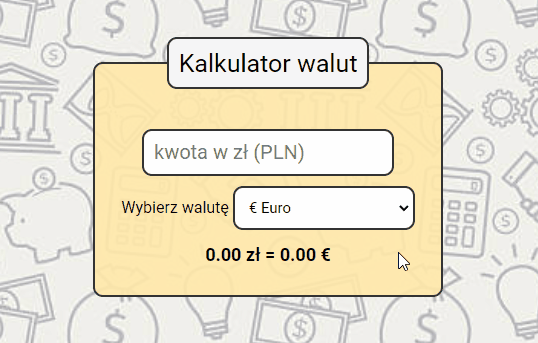

# Currency Calculator

### Description:

Simple currency calculator.\
Converts the amount in PLN into a selected other currency in real time

### Demo:
https://pafeup.github.io/currency-calculator/calculator.html

### Tools & Technologies:
1. HTML
2. CSS
3. Java Script 
4. Normalize CSS
5. BEM convention
6. FLEX box
7. JS - arrow function